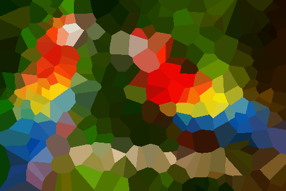

Voronoi
===============================

This little project:

* Chooses a bunch of random points on an image.
* Assigns each pixel to one of the random points (Voronoi).
* Paints all the pixels belonging to one point in the average color of them all.

It's just a little challenge:

* Try to get good performance, by using algorithms with good complexity and by avoiding inefficiencies. No advanced math or GPUs, though.
* Make it all as type-safe as possible.

Examples
-------------------------------

The original image followed by Voronoi colorization under L1 (manhattan), L2 (euclidean) and L3 norm:

Performance
-------------------------------

* There are a lot of wrapper types for safety, but these shouldn't cost anything in Rust.
* Try to avoid heap allocations. The image itself, the list of centers and the pixel mapping should be heap-allocated though, their size is large and unknown at compile-time.
* Try to avoid dynamic dispatch completely.
* Avoid unnecessary math, e.g. L1/L2/L3 norm values have the same total order without the square/cubic root.
* Avoid unnecessary allocations, i.e. keep recycling one vector per thread to store nearest points.
* Assigning pixels to centers and colorizing the pixels can be parallellized per row without locks. Averaging the colors is harder because the average would be mutably shared.

The Voronoi transform above, with 500 pixels per patch on a small image, takes between 0.02s and 0.05s on my machine overall. This is mostly loading and saving of data and starting of the thread pool - without those, it takes 0.0073s or 137x per second. The binary is 1.4mb.

Types
-------------------------------

There are several considerations for type safety:

* There are pixels indexed in two dimensions by positive integers. We should not mix these dimensions or compare x and y for different points.
* There is iteration over bounded regions of the image. So a total ordering as well as addition and subtraction are needed.
* The sum of pixel positions has no meaning, but they may be summed to compute a midpoint position. But they can be subtracted, which gives a distance that can be negative - unlike indices themselves.
* Distances are not real numbers and do not care about direction.
* For polymorphism reasons, different norms should return identical or compatible types, even though their physical units are different, since `sqrt`s are skipped.
* Created wrapper types for most collections to prevent accessing incorrectly.

Difficulties:

* Some operations cannot be overloaded generically but have to be re-done for every concrete type because of orphan rules. Macros help a little here.
* It is necessary to expose the `usize` data for e.g. generating random numbers or building a `Vec`.
* There is substantially more code to facilitate types and operations on them than there is 'business' logic.

The type safety and tests worked, in a way: the program immediately worked once it compiled and passed all tests. It did however take more than an order of magnitude longer to make than the slow and naive Python version.

How to use
-------------------------------

To install:

    cargo install voronoiify-image

The most simple use is `voronoi my/img/path.png`.

Several customization options can be found in `voronoi --help`.

    Voronoiify
    Group image into voronoi-based patches and assign the average color to each patch
    
    USAGE:
      voronoi [FLAGS] [OPTIONS] <IN_PTH>
    
    FLAGS:
      -h, --help       Prints help information
      -s, --show       Show the generated image using EOG
      -V, --version    Prints version information
    
    OPTIONS:
      -o, --output <OUT_PTH>           Path to store the generated file
      -r, --seed <SEED>                Random seed between 0 and 2^64 (exclusive)
      -c, --patch_size <PATCH_SIZE>    Average number of pixels per group
    
    ARGS:
      <IN_PTH>    Input png file to voronoiify

The package is stable, but is not very rich in features. I.e. it is only tested with png images without alpha channels, and displaying the image is done with EOG. Pull requests are welcome!

Development use:

* Compile: `cargo build --release --bin voronoi-benchmark --bin voronoi`
* Run: `target/release/voronoi resources/imgs/parrots.png --show`
* Benchmark: `time target/release/voronoi-benchmark`

Random observations / hints:

* Almost everything gets inlines at -O3, so flamegraphs don't work well.
* To see generated code from derives `cargo rustc -- -Z unstable-options --pretty=expanded`.
* To profile, `valgrind --tool=callgrind --dump-instr=yes --collect-jumps=yes --simulate-cache=yes`, but note that lots of stuff gets inlined.
* Allocating a vector of center links per iteration was somehow faster than recycling the same vector repeatedly.
* Removing all explicit inlines slightly improved performance.

Flamegraphs
-------------------------------

I previously experimented with ``flame``/``flamer`` (feature: ``flame_it``), but I switched to cargo flamegraph_ (fewer code change and can fold stack).

Then make sure that:

* ``perf`` is installed, on Ubuntu: ``apt-get install linux-tools-common linux-tools-generic linux-tools-$(uname -r)``
* ``cargo install flamegraph``
* In ``Cargo.toml``, you have ``debug = true`` for ``[profile.release]``.
* In ``RUSTFLAGS``, you have ``-Cinline-threshold=0``.

Then create the flamegraph like this::

    RUSTFLAGS="-Ctarget-cpu=native -Cinline-threshold=0" cargo flamegraph -o target/flame.svg --bin=voronoi-benchmark -- --reps 500
    firefox target/flame.svg

Note that disabling inlining may double the time needed to run.

Common commands
-------------------------------

* Run in debug mode: ``cargo build --all-targets --all-features``
* Get timing: ``RUSTFLAGS="-Ctarget-cpu=native -Clink-arg=-s" cargo build --release --bin voronoi-benchmark --no-default-features && sleep 0.2 && target/release/voronoi-benchmark --reps 500``
* Flamegraph: ``RUSTFLAGS="-Ctarget-cpu=native -Cinline-threshold=0" cargo flamegraph -o target/flamegraph.svg --bin voronoi-benchmark -- --reps 500 && firefox target/flamegraph.svg``
* See assembly: ``objdump -dS target/release/voronoi-benchmark > voronoi-benchmark.asm`` (same cargo command as flamegraph)

.. _flamegraph: https://github.com/ferrous-systems/flamegraph
